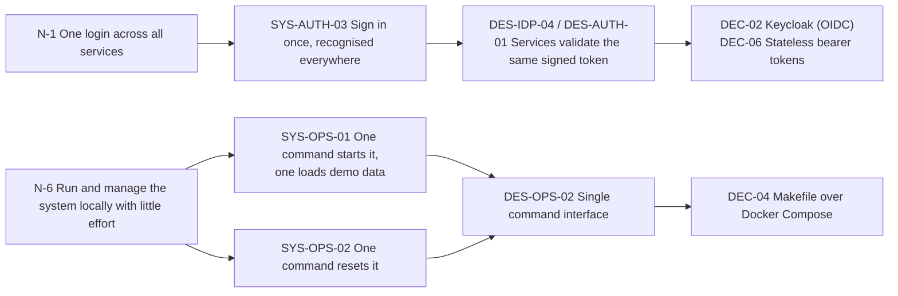

# Gradian Core Service - Requirements

Draft · 2026-10-04

Part of a four-document set:

| # | Document | Answers |
| --- | --- | --- |
| 01 | **Requirements** (this document) | What the system must do, and why |
| 02 | [Design and API contract](02-design.md) | How the requirements are met |
| 03 | [Decision log](03-decisions.md) | Which tools and approaches were chosen, and why |
| 04 | [Test plan](04-test-plan.md) | How each requirement is verified |

Page layouts and navigation belong to a separate Frontend Requirements document, and table-level schemas to a Database Requirements document. Neither is written yet.

## 0. How to read this document

Requirements form a hierarchy. Each level answers the question the level above leaves open, and each item names its parent in a **Derived from** column.

| Level | Prefix | Question it answers | Lives in |
| --- | --- | --- | --- |
| Need | `N-` | What does the course or TA want to achieve? | This document |
| Constraint | `CON-` | What is imposed from outside? | This document |
| System requirement | `SYS-` | What must the system do, observably? | This document |
| Design requirement | `DES-` | How is that behaviour realised? | 02 Design |
| Decision | `DEC-` | Which tool or approach was chosen, and why? | 03 Decision log |
| Test | by requirement ID | How do we know it works? | 04 Test plan |

Every item carries a **Kind** so you can see where it came from:

| Kind | Meaning |
| --- | --- |
| **Source** | Stated in the design PDF or in the TA's brief |
| **Inferred** | Not stated, but implied by something that was |
| **Proposed** | A default suggested in this draft; needs confirmation (section 6) |
| **Mandated** | A constraint imposed by the TA |

Two worked chains show how a need turns into a tool choice:

The Makefile is a decision (`DEC-04`). The requirement behind it is that local operation is easy and centralized (`N-6`, `SYS-OPS-*`). Replacing the Makefile with another tool changes only `DEC-04` and `DES-OPS-*`; the requirements and tests above them stay valid.

## 1. Context

Gradian (گرادیان) is a Konkur preparation platform. The **Core Service** provides the landing page content, sign-in, four role-based panels and the links into services that student project groups build as separate projects. Those group services connect to the Core Service and trust its identity.

## 2. Needs

| ID | Need | Kind |
| --- | --- | --- |
| N-1 | One login works across the Core Service and every group service | Source (brief: Keycloak SSO) |
| N-2 | Each kind of user reaches the right role-specific panel and can use only that panel's services | Source (PDF: Authentication, panels) |
| N-3 | Project groups can plug their services into the platform without changing Core code | Source (brief: core service that groups connect to) |
| N-4 | A person's name, email and mobile number are the same in every service | Source (brief: identity synced in SSO) |
| N-5 | Groups have realistic users and data to work with from day one | Source (PDF: seed note) |
| N-6 | The TA and the groups can run and manage the system locally with little effort | Source (TA: Makefile, centralized local management) |
| N-7 | The delivered Core Service can be shown to be correct, repeatably | Source (brief: tests to verify requirements) |
| N-8 | The landing page and panels show the designed content, with display-only parts filled by demo data | Source (PDF: all pages) |
| N-9 | A visitor can create an account on their own, and administrators can create accounts of any kind and change people's roles | Source (project owner) |

## 3. Constraints

| ID | Constraint | Kind |
| --- | --- | --- |
| CON-01 | The Core Service is a Django project | Mandated |
| CON-02 | Identity and single sign-on are provided by Keycloak | Mandated |
| CON-03 | The Keycloak user profile holds email, first name and last name in addition to the login identity | Mandated |
| CON-04 | Group services are separate projects that connect to the Core Service | Mandated |

## 4. System requirements

### 4.1 Authentication

| ID | Requirement | Derived from | Kind |
| --- | --- | --- | --- |
| SYS-AUTH-01 | A user signs in with a mobile number and a password. | N-2 | Source (PDF: Authentication) |
| SYS-AUTH-02 | After signing in, the user lands on the panel for their role (AC-ROUTE). | N-2 | Source (PDF: Authentication) |
| SYS-AUTH-03 | A user who has signed in once is recognised by the Core Service and by every group service without signing in again. | N-1 | Source (brief: SSO) |
| SYS-AUTH-04 | A "remember me" option keeps the user signed in for longer than a normal session. | N-2 | Source (PDF: checkbox); durations Proposed |
| SYS-AUTH-05 | Wrong credentials are refused without revealing whether the mobile number exists, and repeated failures are temporarily blocked. | N-1 | Proposed |
| SYS-AUTH-06 | The logout icon in every panel ends the session and returns the user to the landing page. | N-2 | Source (PDF: panels) |
| SYS-AUTH-07 | An account with more than one panel role cannot enter any panel. An account with no panel role is a student. | N-2, N-9 | Inferred; student default decided by the project owner |
| SYS-AUTH-08 | A disabled account cannot sign in or use the platform. | N-2 | Inferred |
| SYS-AUTH-09 | Accounts are created by self-registration, by an administrator or by seeding. There is no password recovery. | N-2, N-9 | Inferred (PDF shows no recovery); self-registration decided by the project owner |
| SYS-AUTH-10 | A visitor can register with first name, last name, mobile number, email and password. The new account is a student and is signed in at once. | N-9 | Source (project owner) |

### 4.2 Access control

| ID | Requirement | Derived from | Kind |
| --- | --- | --- | --- |
| SYS-ACC-01 | Anonymous visitors can reach only public content: the landing page content and the sign-in. | N-2 | Source (PDF: Landing page) |
| SYS-ACC-02 | A signed-in user can use only the panel and services of their own role (AC-ACCESS). | N-2 | Inferred |

### 4.3 Identity

| ID | Requirement | Derived from | Kind |
| --- | --- | --- | --- |
| SYS-ID-01 | Every account has a mobile number, an email, a first name, a last name and exactly one role. An account missing any of them cannot exist. | N-4, CON-03 | Source (brief: profile schema) |
| SYS-ID-02 | When a user's name, email, mobile number or role changes in the identity provider, every service shows the new value without manual copying. | N-4 | Source (brief: everything synced) |
| SYS-ID-03 | Each identity field has one owner, the identity provider. Neither the Core Service nor a group service keeps an independently editable copy. | N-4 | Source (brief) |
| SYS-ID-04 | A mobile number written with Persian digits or with a `+98` prefix is treated as the same number as its plain form. | N-4 | Proposed |
| SYS-ID-05 | An identity change made through the Core Service is applied in the identity provider first; if that fails, nothing changes anywhere. | N-4 | Proposed |
| SYS-ID-06 | Each panel header shows the user's full name; the student panel also shows the field of study. | N-8 | Source (PDF: student panel header) |

### 4.4 Panels and services

| ID | Requirement | Derived from | Kind |
| --- | --- | --- | --- |
| SYS-PNL-01 | The student panel offers the 10 services in AC-SERVICES, each opening its group-built service. | N-2, N-3 | Source (PDF: student panel) |
| SYS-PNL-02 | The admin, consultant and professor panels offer 3, 6 and 6 services respectively (AC-SERVICES); choosing one loads it in the panel's content area. | N-2, N-3 | Source (PDF: panels) |
| SYS-PNL-03 | Panels show the display-only items from the design: notification bell, Konkur countdown, and for students the welcome message, study streak and experience-feed preview. | N-8 | Source (PDF: panels) |
| SYS-PNL-04 | All display-only content is realistic demo data that can be changed without changing code. | N-8 | Source (PDF: "complete with demo data"); no-code-change Proposed |
| SYS-PNL-05 | A service that no group has connected yet appears as unavailable instead of breaking the panel. | N-3 | Inferred |
| SYS-PNL-06 | A service offered to several roles (counseling sessions, resources hub, professional profile, private class) can be backed by one group service while staying separately configurable per panel. | N-3 | Inferred |

### 4.5 Integration of group services

| ID | Requirement | Derived from | Kind |
| --- | --- | --- | --- |
| SYS-INT-01 | A group connects its service to a panel entry by configuration only, without changing Core code. | N-3 | Source (brief) |
| SYS-INT-02 | A group service can tell who the signed-in user is and what their role is from the credential the platform provides, and can refuse anyone else. | N-1, N-3 | Source (brief) |
| SYS-INT-03 | A group service can look up a user's identity by id, and list users by role, through the Core Service. Every user is valid for every group's service. | N-3, N-5 | Inferred; scope decided by the project owner |
| SYS-INT-04 | A group can check that its service follows the platform's integration rules. | N-3 | Proposed |
| SYS-INT-05 | A connected service is reachable from the panel either embedded in the content area or by redirect. | N-3 | Source (PDF: content area); redirect Inferred |

### 4.6 Seed data

| ID | Requirement | Derived from | Kind |
| --- | --- | --- | --- |
| SYS-DATA-01 | After setup, the system holds users of every role who can sign in. | N-5 | Source (PDF: seed note) |
| SYS-DATA-02 | Seeded users have complete identity data and realistic Persian names, and use mobile numbers and emails that cannot belong to real people. | N-5 | Proposed |
| SYS-DATA-03 | Seeded users are allocated to project groups, so that each group has its own users of every role (AC-SEED) to develop with. The allocation exists only in the seed and the credential files: the system does not record groups, and every user is valid for every group's service. | N-5 | Source (PDF: "give them to groups"); quantities Proposed |
| SYS-DATA-04 | Loading the demo data can be repeated without creating duplicates or changing the result. | N-5, N-6 | Proposed |
| SYS-DATA-05 | The TA can obtain, per group, the list of its users with their sign-in details. | N-5 | Inferred |
| SYS-DATA-06 | The demo data covers everything the panels display: the 25 service entries, the landing content and the widget data. | N-8 | Inferred |
| SYS-DATA-07 | Demo accounts and their shared password cannot be created in a production environment. | N-5 | Proposed |

### 4.7 Local operation

| ID | Requirement | Derived from | Kind |
| --- | --- | --- | --- |
| SYS-OPS-01 | From a clean clone, one command starts the whole system with the demo data loaded. | N-6 | Proposed (from the TA's Makefile intent) |
| SYS-OPS-02 | One command returns the system to a clean state with demo data. | N-6 | Proposed |
| SYS-OPS-03 | One command runs the fast tests, and one runs the tests that need the full system. | N-6, N-7 | Proposed |
| SYS-OPS-04 | The available commands are discoverable and behave the same on every team member's machine. | N-6 | Proposed |
| SYS-OPS-05 | All settings come from the environment, with a documented example; no secret is committed. | N-6 | Proposed |
| SYS-OPS-06 | If a required setting is missing, startup fails with a message naming it. | N-6 | Proposed |

### 4.8 Quality attributes

| ID | Requirement | Derived from | Kind |
| --- | --- | --- | --- |
| SYS-NFR-01 | Security: passwords and tokens never appear in logs or error messages; production runs over HTTPS with standard hardening; public endpoints are rate-limited. | N-1 | Proposed |
| SYS-NFR-02 | Performance: at 50 concurrent users, identity and panel requests are answered within 300 ms for 95% of requests. | N-2 | Proposed |
| SYS-NFR-03 | Resilience: if the identity provider is briefly unreachable, users who are already signed in keep working, and the readiness check reports the problem. | N-1 | Proposed |
| SYS-NFR-04 | Compatibility: once groups start integrating, the published API changes only by adding. | N-3 | Proposed |
| SYS-NFR-05 | Language: the system defaults to Persian and the Tehran time zone; user-facing messages are Persian. | N-8 | Inferred (Persian UI) |
| SYS-NFR-06 | Observability: sign-in provisioning, role failures and identity sync changes are logged. | N-7 | Proposed |
| SYS-NFR-07 | Documentation: a README gets a newcomer to a running system, and an integration guide tells a group how to connect a service. | N-3, N-6 | Proposed |
| SYS-NFR-08 | Verifiability: every requirement in this document is covered by at least one automated or scripted check, or is marked in the test plan as relying on an external implementation, and a report lists any that are neither. | N-7 | Proposed |

### 4.9 Account administration

| ID | Requirement | Derived from | Kind |
| --- | --- | --- | --- |
| SYS-ADM-01 | An administrator can create an account of any role, with its password, and the person can sign in at once. | N-9 | Source (project owner) |
| SYS-ADM-02 | An administrator can change a person's role. The new role is the person's only panel role. | N-9 | Source (project owner) |
| SYS-ADM-03 | An administrator can list accounts, filtered by role and status, and can disable and re-enable an account. | N-9 | Inferred |
| SYS-ADM-04 | Only administrators can use these functions, and an administrator cannot change their own role or status. | N-2, N-9 | Inferred |

## 5. Acceptance criteria

### AC-ROUTE: role to panel

| Account type | Role | Lands on |
| --- | --- | --- |
| Student (داوطلب), or a person with no role yet | `student` | Student panel |
| Consultant (مشاور) or top-ranker (رتبه برتر) | `consultant` | Consultant panel |
| Professor (استاد) | `professor` | Professor panel |
| Admin | `admin` | Admin panel |

### AC-ACCESS: who can do what

Denied means the request is refused; the test plan fixes the exact responses.

| Capability | Anonymous | Student | Consultant | Professor | Admin | Platform service |
| --- | --- | --- | --- | --- | --- | --- |
| View landing content | Allowed | Allowed | Allowed | Allowed | Allowed | Allowed |
| View own identity and panel assignment | Denied | Allowed | Allowed | Allowed | Allowed | Denied |
| List the services of own panel | Denied | Allowed (10) | Allowed (6) | Allowed (6) | Allowed (3) | Denied |
| View student dashboard widgets | Denied | Allowed | Denied | Denied | Denied | Denied |
| List, create and change accounts and roles | Denied | Denied | Denied | Denied | Allowed | Denied |
| List users, filtered by role | Denied | Denied | Denied | Denied | Allowed | Allowed |
| Look up any user's identity by ID | Denied | Denied | Denied | Denied | Denied | Allowed |

A platform service is a machine client, such as a group service, acting with its own credential and no user.

### AC-SERVICES: the 25 service entries

| Key | Panel | Title | Persian title |
| --- | --- | --- | --- |
| `student.simulated-exam` | Student | Simulated Konkur exam | آزمون شبیه‌ساز کنکور |
| `student.topic-exam` | Student | Topic-based exam | آزمون مبحثی |
| `student.final-exam-12th` | Student | 12th-grade final exam | امتحان نهایی دوازدهم |
| `student.major-selection` | Student | Smart major selection | انتخاب رشته هوشمند |
| `student.top-ranker-experiences` | Student | Top-rankers' experiences and Q&A | تجارب رتبه‌های برتر و رفع اشکال درسی |
| `student.courses` | Student | Courses and test tips | دوره‌های آموزشی و نکته و تست |
| `student.private-class` | Student | Private class | کلاس خصوصی |
| `student.marketplace` | Student | Book and resource marketplace | خرید و فروش منابع و کتاب |
| `student.counseling-planning` | Student | Counseling and planning | مشاوره و برنامه‌ریزی |
| `student.experience-exchange` | Student | Experience-exchange network | شبکه اجتماعی تبادل تجربیات |
| `admin.exam-bank` | Admin | Exam and simulator bank | بانک آزمون و شبیه‌ساز |
| `admin.counseling-sessions` | Admin | Online counseling sessions | جلسات مشاوره آنلاین |
| `admin.store-management` | Admin | Store product management | مدیریت محصولات فروشگاه |
| `consultant.profile` | Consultant | Complete professional profile | تکمیل پروفایل حرفه‌ای |
| `consultant.student-reports` | Consultant | Student reports dashboard | داشبورد گزارشات دانش آموز |
| `consultant.add-experiences` | Consultant | Add experiences | اضافه کردن تجربیات |
| `consultant.resolve-problems` | Consultant | Resolve academic problems | رفع اشکال درسی |
| `consultant.counseling-sessions` | Consultant | Online counseling sessions | جلسات مشاوره آنلاین |
| `consultant.resources-hub` | Consultant | Konkur resources and notes hub | هاب منابع و جزوات کنکور |
| `professor.profile` | Professor | Complete professional profile | تکمیل پروفایل حرفه‌ای |
| `professor.progress-dashboard` | Professor | Academic progress dashboard | داشبورد پیشرفت تحصیلی |
| `professor.exam-question-management` | Professor | Exam and question management | مدیریت آزمون و سوال |
| `professor.create-course` | Professor | Create course | ایجاد دوره آموزشی |
| `professor.private-class` | Professor | Private class | کلاس خصوصی |
| `professor.resources-hub` | Professor | Konkur resources and notes hub | هاب منابع و جزوات کنکور |

### AC-SEED: default seed allocation

The number of project groups is a setting, default 10. A group is only an allocation of seeded users and of a service client; the system does not record it.

| Role | Per group | Total at 10 groups |
| --- | --- | --- |
| Student | 4 | 40 |
| Consultant | 1 | 10 |
| Top-ranker (role `consultant`) | 1 | 10 |
| Professor | 1 | 10 |
| Admin | 1 | 10 |

One further TA admin account belongs to no group.

## 6. Open questions and proposed values

### 6.1 Open questions

Each feeds a decision in the log, which is marked *Assumed* until the question is answered.

| # | Question | Assumption used | Feeds |
| --- | --- | --- | --- |
| Q1 | How does the user sign in: a themed Keycloak page, or a custom form in the Gradian frontend? | Themed Keycloak page | DEC-05 |
| Q2 | Does "groups" in the PDF's seed note mean student project groups? | Yes, confirmed: the teams that build the group services | DEC-14 |
| Q3 | Can a user belong to several groups? | Moot: every user is valid for every group; the seed only gives each group its own users to work with | DEC-14 |
| Q4 | Are group services embedded in the panel or opened by redirect? | Either, chosen per entry | DEC-10 |
| Q5 | Does the course use one shared, long-lived Keycloak, or does everyone run their own copy? | Own copy locally; one shared instance for integration | DEC-11 |
| Q6 | How many seeded users does each group need? | See AC-SEED | DEC-11 |
| Q7 | How soon must an identity change appear in the Core Service? | Within one access-token lifetime | DEC-07 |
| Q8 | Must a registrant prove they own the mobile number (SMS code)? | No; accepted for now, ownership is unverified | DEC-21 |

### 6.2 Proposed values to confirm

These numbers have no source in the PDF or brief.

| Value | Proposed | Used by |
| --- | --- | --- |
| Remember-me session length | 30 days | SYS-AUTH-04 |
| Normal session idle timeout | 30 minutes | SYS-AUTH-04 |
| Failed sign-ins before temporary lockout | 5 | SYS-AUTH-05 |
| Access-token lifetime | 10 minutes at most | SYS-AUTH-08, SYS-NFR-03 |
| Load target | 50 concurrent users, 300 ms at the 95th percentile | SYS-NFR-02 |
| Seed allocation and group count | AC-SEED, 10 groups | SYS-DATA-03 |
| Minimum password length | 8 characters | SYS-AUTH-10, SYS-ADM-01 |

## 7. Out of scope

- The behaviour of the 25 group-built services themselves.
- Page layouts, routing and visual design (Frontend Requirements).
- Table-level schemas (Database Requirements).
- Password recovery, verification of mobile numbers or email addresses, payments and real notifications.