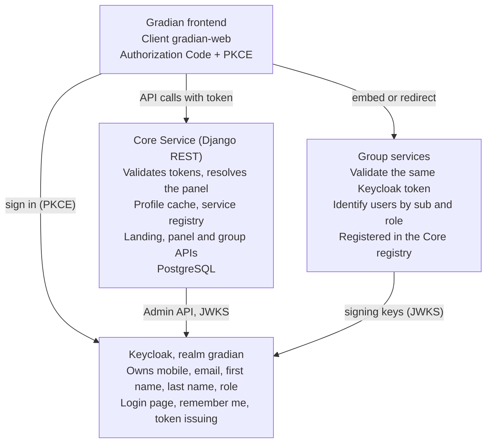
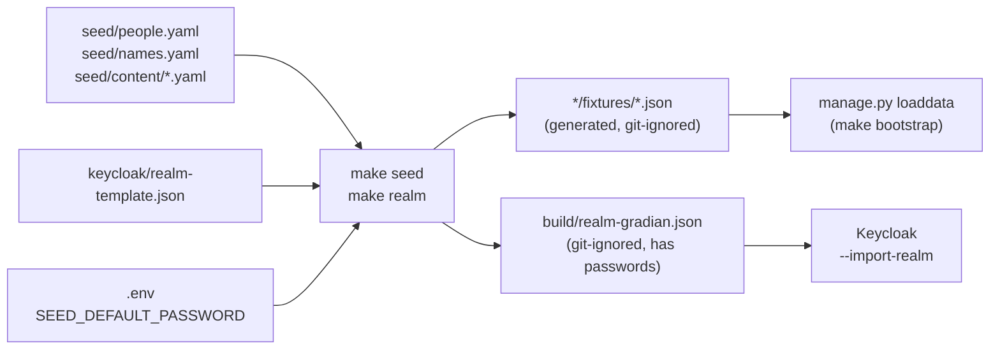
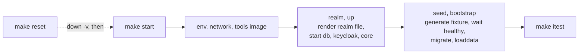

# Gradian Core Service - Design and API Contract

Draft · 2026-10-04

Part of a four-document set: [01 Requirements](01-requirements.md) · **02 Design** (this document) · [03 Decision log](03-decisions.md) · [04 Test plan](04-test-plan.md).

This document says how the system requirements are met. Each design requirement (`DES-`) names the `SYS-` items it **Satisfies** and the decision (`DEC-`) it follows. The tools themselves are justified in the decision log, not here. Section 10 shows, for every system requirement, which design items cover it, so a gap is visible at a glance.

## 1. Architecture



| ID | Design requirement | Satisfies | Decision |
| --- | --- | --- | --- |
| DES-ARC-01 | The platform consists of Keycloak (identity), the Core Service (Django REST API and Django admin, backed by PostgreSQL), the group services, and the frontend. Only Keycloak holds credentials and identity data; the Core Service holds a read cache of it. | SYS-AUTH-03, SYS-ID-03, SYS-INT-01 | DEC-01, DEC-02, DEC-03 |

### Repository layout

```
Makefile
docker-compose.yml
.env.example
keycloak/
    realm-template.json        # roles, clients, user profile, mappers (no users)
    themes/gradian/            # login page theme
seed/
    people.yaml                # groups, per-role counts, mobile scheme
    names.yaml                 # Persian first and last name pools
    content/                   # landing, widgets, service entries
scripts/
    seed_generate.py           # builds fixtures and the Keycloak realm file
    check_service.py           # group-service conformance check
    wait_for.sh                # waits until Keycloak and Core are healthy
core/                          # the Django project
    accounts/  registry/  panels/
    */fixtures/*.json          # generated by `make seed`, git-ignored
    */tests/
build/                         # generated, git-ignored (realm file, credentials)
```

## 2. Identity provider (Keycloak)

| ID | Design requirement | Satisfies | Decision |
| --- | --- | --- | --- |
| DES-IDP-01 | One realm, `gradian`, is created on first start from `keycloak/realm-template.json` merged with the seeded users (section 7). | SYS-DATA-01, SYS-OPS-01 | DEC-02, DEC-11 |
| DES-IDP-02 | The username is the mobile number in normalized form `09XXXXXXXXX`. Login by email and password reset are disabled; self-registration is enabled (DES-IDP-10). | SYS-AUTH-01, SYS-AUTH-09 | DEC-02, DEC-21 |
| DES-IDP-03 | Realm roles: `student`, `consultant`, `professor`, `admin`, and `service` for machine clients. A top-ranker has role `consultant` plus the user attribute `consultant_type=top_ranker`; a plain consultant has `consultant_type=consultant`. | SYS-AUTH-02, SYS-AUTH-07 | DEC-09 |
| DES-IDP-04 | Clients: `gradian-web` (public, Authorization Code with PKCE, exact redirect URIs, direct password grants off); `gradian-core` (confidential, its service account may read and update users through the Admin API). A scope adds `gradian-core` to the token audience. Each group service gets its own client or audience the same way. | SYS-AUTH-03, SYS-INT-02 | DEC-02, DEC-05 |
| DES-IDP-05 | The Keycloak user profile declares `mobile`, `email`, `firstName` and `lastName` as required, with the validations in section 3.1. Email is unique in the realm. | SYS-ID-01 | DEC-02 |
| DES-IDP-06 | Access and ID tokens carry the claims in the table below. | SYS-AUTH-02, SYS-ID-06, SYS-INT-02 | DEC-02 |
| DES-IDP-07 | Remember me is enabled. With it, a session lasts up to 30 days; without it, the session ends after 30 minutes idle or on browser close. Access tokens last 10 minutes at most. Brute-force protection locks an account temporarily after 5 failed sign-ins, and login errors are identical for unknown numbers and wrong passwords. | SYS-AUTH-04, SYS-AUTH-05, SYS-NFR-01 | DEC-02 |
| DES-IDP-08 | The login and registration pages are one Keycloak theme, `gradian`, in `keycloak/themes/gradian/login/`: Persian and right-to-left, with a login page (mobile field, password field with show/hide toggle, remember-me box, one "ورود به سامانه" button) and a registration page (DES-IDP-10). Markup is thin and all appearance is in CSS, so the frontend team can replace the design without touching the logic; the theme's README is their contract. | SYS-AUTH-01, SYS-AUTH-10 | DEC-05, DEC-21 |
| DES-IDP-10 | The registration page asks for first name, last name, mobile number (the username), email, password and its confirmation, and applies the user-profile validations of section 3.1 and a password of at least 8 characters. Keycloak signs the new person in. The new account has no panel role; Core treats it as a student (DES-AUTH-02) and grants the role in Keycloak (DES-AUTH-07). The page opens at the realm's `registrations` endpoint, which `GET /api/v1/auth/config` returns as `registration_endpoint`. Mobile ownership is not verified (Q8). | SYS-AUTH-10, SYS-AUTH-09 | DEC-21 |
| DES-IDP-09 | A test-only client `gradian-test` with direct password grants exists only in realm files rendered for a non-production environment, so tests can obtain tokens without a browser. | SYS-NFR-08 | DEC-13 |

### Token claims

| Claim | Source in Keycloak | Used for |
| --- | --- | --- |
| `sub` | User ID | Primary key of the person in every service |
| `preferred_username` | Username | Mobile number |
| `email` | Email | Contact and display |
| `given_name` | First name | Display name |
| `family_name` | Last name | Display name |
| `realm_access.roles` | Realm roles | Panel selection and authorization |
| `consultant_type` | User attribute | Telling a top-ranker from a consultant |
| `iss`, `aud`, `exp` | Standard | Token validation |

## 3. Identity data and sync

### 3.1 Profile schema

Keycloak owns every attribute marked Keycloak. The Core Service stores them only as a read cache.

| Attribute | Keycloak field | Token claim | Required | Validation | Owner |
| --- | --- | --- | --- | --- | --- |
| Keycloak ID | User ID | `sub` | Yes | UUID, unique | Keycloak |
| Mobile number | Username and `mobile` | `preferred_username` | Yes | `^09\d{9}$`, unique | Keycloak |
| Email | `email` | `email` | Yes | Valid address, unique in realm | Keycloak |
| First name | `firstName` | `given_name` | Yes | 1 to 100 characters; Unicode letters, spaces, ZWNJ | Keycloak |
| Last name | `lastName` | `family_name` | Yes | Same as first name | Keycloak |
| Role | Realm role | `realm_access.roles` | Yes | Exactly one panel role | Keycloak |
| Consultant type | `consultant_type` | `consultant_type` | Consultants | `consultant` or `top_ranker` | Keycloak |
| Enabled | `enabled` | none | Yes | Disabled users cannot sign in | Keycloak |
| Field of study (رشته) | none | none | Students | For example experimental, mathematics, humanities | Core |
| Avatar, short bio | none | none | No | Image URL; up to 500 characters | Core |

### 3.2 Design requirements

| ID | Design requirement | Satisfies | Decision |
| --- | --- | --- | --- |
| DES-ID-01 | The Core `Profile` table is keyed by `sub`. It holds the cached Keycloak attributes above, the Core-owned attributes, and an `is_active` flag. Identity fields are read-only in every serializer and in the Django admin. | SYS-ID-02, SYS-ID-03, SYS-ID-06 | DEC-07 |
| DES-ID-02 | On the first authenticated request from an unknown `sub`, the profile is created from the token claims. A valid token missing a required claim is refused with 403 `incomplete_identity`. | SYS-ID-01, SYS-ID-02 | DEC-07 |
| DES-ID-03 | On every authenticated request, the claims are compared with the cached values and the cache is updated in the same request when they differ. A Keycloak change is therefore visible within one access-token lifetime. | SYS-ID-02 | DEC-07 |
| DES-ID-04 | A management command `sync_keycloak_users` reads all users through the Admin API (people with no panel role count as students, service accounts are skipped) and creates, updates or deactivates profiles. Users deleted in Keycloak are deactivated, never hard-deleted. `--dry-run` lists mismatches and writes nothing. | SYS-ID-02, SYS-AUTH-08 | DEC-07 |
| DES-ID-05 | `PATCH /api/v1/me` writes identity changes to Keycloak through the Admin API first and updates the cache only after Keycloak accepts them. On failure it returns 502 `identity_provider_unavailable` and stores nothing. | SYS-ID-03, SYS-ID-05 | DEC-08 |
| DES-ID-06 | One mobile-normalization function converts Persian and Arabic digits to ASCII and the prefixes `+98` and `0098` to a leading `0`, then validates. The API, the sync command and the seed generator all use it. | SYS-ID-04 | DEC-07 |

## 4. Authentication and authorization

Sign-in sequence: the frontend starts Authorization Code with PKCE at Keycloak; Keycloak shows the Gradian login page and checks the credentials; the frontend exchanges the code for tokens and calls `GET /api/v1/me`; the Core Service validates the token, creates or syncs the profile, resolves the panel and returns `panel` and `home_path`; the frontend routes to `home_path`.

| ID | Design requirement | Satisfies | Decision |
| --- | --- | --- | --- |
| DES-AUTH-01 | Every non-public request must carry `Authorization: Bearer <access token>`. The Core Service validates it locally: signature against the realm's JWKS (cached, refreshed on an unknown `kid`), issuer, expiry, and that `aud` contains `gradian-core`. Any failure, including `alg: none` and a tampered payload, returns 401. | SYS-AUTH-03, SYS-ACC-01, SYS-NFR-02, SYS-NFR-03 | DEC-06 |
| DES-AUTH-02 | The panel is resolved from `realm_access.roles` (`student`, `consultant`, `professor`, `admin`); other realm roles such as `offline_access` are ignored. No panel role means `student`; more than one returns 403 `ambiguous_role`. | SYS-AUTH-02, SYS-AUTH-07 | DEC-09 |
| DES-AUTH-03 | Each panel endpoint uses a permission class that requires its panel role (another role returns 403, no token returns 401). Platform-service endpoints require the `service` role, carried by a client-credentials token. | SYS-ACC-02, SYS-INT-03 | DEC-06, DEC-09 |
| DES-AUTH-04 | A profile with `is_active = false` is refused with 403 `account_disabled`, even when the token has not expired. | SYS-AUTH-08 | DEC-07 |
| DES-AUTH-05 | `GET /api/v1/auth/config` returns the issuer, realm, client ID, registration endpoint, Keycloak end-session URL and landing URL. The frontend's logout icon ends the Keycloak session and returns to the landing page. Access tokens cannot be revoked before they expire, so their short lifetime (DES-IDP-07) bounds exposure. | SYS-AUTH-06 | DEC-05, DEC-06 |
| DES-AUTH-07 | The first time Core sees a person with no panel role, it grants the realm role `student` in Keycloak through the Admin API, so group services, which read the role from the token, see it in the next token. A failure is logged and does not refuse the person. | SYS-AUTH-07, SYS-AUTH-10 | DEC-21 |
| DES-AUTH-06 | `GET /api/v1/me` returns `panel` and `home_path`, where `home_path` is `/student`, `/consultant`, `/professor` or `/admin`. | SYS-AUTH-02 | DEC-09 |

## 5. Service registry and group integration

| ID | Design requirement | Satisfies | Decision |
| --- | --- | --- | --- |
| DES-REG-01 | A `ServiceEntry` table holds, per entry: key, panel, Persian and English title, description, button label, icon, display order, target URL, integration mode, enabled flag and owner project group. The 25 entries of AC-SERVICES are loaded from a fixture with stable keys. Target URL and mode are editable in the Django admin without a deploy. | SYS-PNL-01, SYS-PNL-02, SYS-INT-01 | DEC-10 |
| DES-REG-02 | An entry is reported with `status: "unavailable"` when it has no target URL or is disabled; the panel still loads. | SYS-PNL-05 | DEC-10 |
| DES-REG-03 | A service shown in several panels is several independent entries, which may share a target service with a role-specific URL or path. Editing one does not change another. | SYS-PNL-06 | DEC-10 |
| DES-REG-04 | The integration mode is `embed` (loaded in the panel's content area) or `redirect`. An embedded service must allow framing and cross-origin calls from the frontend origin; a redirected service must offer a way back to the panel. | SYS-PNL-02, SYS-INT-05 | DEC-10 |
| DES-REG-05 | Every group service must: accept the Keycloak access token as a Bearer token and validate signature, issuer, expiry and that `aud` contains its own client ID; identify users by `sub` and authorize by `realm_access.roles`, never from a request body or query string; keep no editable copy of identity fields; expose `GET /health`. | SYS-INT-02, SYS-INT-04, SYS-ID-03 | DEC-06 |
| DES-REG-06 | The repository ships a reference group-service template that validates tokens correctly, and `scripts/check_service.py` (run as `make check-service URL=...`) that checks a service for 401 without a token, 200 with a valid one, 403 for a wrong role, and a passing health check. | SYS-INT-04 | DEC-06 |
| DES-REG-07 | Group services look up users through `GET /api/v1/internal/users/{sub}` and `GET /api/v1/internal/users?role=`, using a client-credentials token with the `service` role. Every user is valid for every group, so the Core Service keeps no group membership. | SYS-INT-03, SYS-DATA-05 | DEC-14 |

### 5.1 Account administration

| ID | Design requirement | Satisfies | Decision |
| --- | --- | --- | --- |
| DES-ADM-01 | `POST /api/v1/admin/users` creates the account in Keycloak (username and `mobile` attribute, names, email, a permanent password, one realm role, and `consultant_type` for a consultant) and only then in the Core cache. If the role cannot be assigned, the Keycloak account is removed again. A mobile number or email already in use is 409 `identity_conflict`; a consultant without `consultant_type` is 400. | SYS-ADM-01 | DEC-22 |
| DES-ADM-02 | `PATCH /api/v1/admin/users/{sub}` changes `role`, `consultant_type`, `is_active`, names, email and the Core-owned `field_of_study`. A new role replaces the person's other panel roles in Keycloak. Changes go to Keycloak first and the cache follows, as in DES-ID-05. The mobile number cannot be changed. A token already issued keeps its old role until it expires (DEC-06). | SYS-ADM-02, SYS-ADM-03 | DEC-22 |
| DES-ADM-03 | `GET /api/v1/admin/users` lists accounts, paginated, filtered by `role`, `is_active` and `q` (part of the mobile number, email or name); `GET /api/v1/admin/users/{sub}` returns one. | SYS-ADM-03 | DEC-22 |
| DES-ADM-04 | These endpoints require the admin panel (a service token is refused). An administrator who changes their own role, consultant type or status gets 403 `self_modification_forbidden`. | SYS-ADM-04 | DEC-22 |

## 6. API contract

The OpenAPI schema generated from the code is the source of truth. This table is its summary and is frozen for removals and renames once groups start integrating.

### 6.1 Conventions

| ID | Design requirement | Satisfies | Decision |
| --- | --- | --- | --- |
| DES-API-01 | All endpoints live under `/api/v1/` and exchange UTF-8 JSON. Errors have one shape, `{"code", "message", "details"}`, with a matching HTTP status; codes are stable English strings and messages are Persian. List endpoints paginate with `limit` and `offset`. Timestamps are ISO 8601 with a UTC offset. | SYS-NFR-04, SYS-NFR-05 | DEC-15 |
| DES-API-03 | The OpenAPI 3 schema and interactive docs are published at `/api/schema/` and `/api/docs/`. After groups start integrating, the schema may gain fields and endpoints but not lose or rename them. | SYS-NFR-04, SYS-NFR-07 | DEC-15 |
| DES-API-04 | The Konkur countdown is computed from the configured date `KONKUR_DATE` and returns the days remaining and a label. | SYS-PNL-03 | DEC-15 |
| DES-API-05 | `GET /api/v1/notifications` returns an unread count and a list, empty by default. The bell is display-only. | SYS-PNL-03 | DEC-15 |
| DES-API-06 | `GET /health/live` reports the process is up; `GET /health/ready` checks the database and Keycloak and fails when either is down. | SYS-NFR-03, SYS-OPS-01 | DEC-15 |
| DES-API-07 | CORS allows only the origins in configuration. Public endpoints are rate-limited with a configurable default. | SYS-NFR-01 | DEC-15 |

### 6.2 Endpoints (DES-API-02)

| Endpoint | Access | Purpose | Satisfies |
| --- | --- | --- | --- |
| `GET /api/v1/landing` | Public | Landing content: navbar, hero, statistics, mission cards, teacher and ranker showcase, testimonials | SYS-ACC-01, SYS-PNL-04 |
| `GET /api/v1/auth/config` | Public | Issuer, realm, client ID, registration endpoint, end-session URL, landing URL | SYS-AUTH-06, SYS-AUTH-10 |
| `GET /api/v1/me` | Any panel role | Identity, display name, panel, home path | SYS-AUTH-02, SYS-ID-06 |
| `PATCH /api/v1/me` | Any panel role | Change identity fields (written through to Keycloak) and Core-owned fields | SYS-ID-05 |
| `GET /api/v1/panel` | Any panel role | Header data and sidebar countdown for the caller's panel | SYS-ID-06, SYS-PNL-03 |
| `GET /api/v1/panel/services` | Any panel role | Service entries of the caller's panel, in display order | SYS-PNL-01, SYS-PNL-02, SYS-PNL-05 |
| `GET /api/v1/student/dashboard` | Student | Welcome, countdown, study streak, experience-feed preview | SYS-PNL-03 |
| `GET /api/v1/notifications` | Any panel role | Bell: unread count and items | SYS-PNL-03 |
| `GET /api/v1/admin/users`, `POST /api/v1/admin/users` | Admin | List accounts; create an account of any role | SYS-ADM-01, SYS-ADM-03, SYS-ADM-04 |
| `GET /api/v1/admin/users/{sub}`, `PATCH /api/v1/admin/users/{sub}` | Admin | Read one account; change its role, status and identity | SYS-ADM-02, SYS-ADM-03, SYS-ADM-04 |
| `GET /api/v1/internal/users` | Service | Users, filterable by `role`, `is_active` and `q` | SYS-INT-03 |
| `GET /api/v1/internal/users/{sub}` | Service | Identity of one user | SYS-INT-03 |
| `GET /health/live`, `GET /health/ready` | Public | Liveness and readiness | SYS-NFR-03 |
| `GET /api/schema/`, `GET /api/docs/` | Public | OpenAPI schema and docs | SYS-NFR-07 |

## 7. Seed data

The seed data has two homes: Keycloak holds the users and their passwords, and Django holds everything the Core Service owns. Both are generated from one source so they cannot drift apart.



| ID | Design requirement | Satisfies | Decision |
| --- | --- | --- | --- |
| DES-DATA-01 | `seed/people.yaml` is the single source: the number of groups, the number of seeded users per role (AC-SEED) and the mobile-number scheme. `seed/names.yaml` holds Persian name pools. `seed/content/` holds the landing, widget and service-entry content. | SYS-DATA-02, SYS-DATA-03, SYS-DATA-06, SYS-PNL-04 | DEC-11 |
| DES-DATA-02 | `scripts/seed_generate.py` is deterministic: the same input always produces byte-identical output. `make seed` writes the fixtures and `make realm` the Keycloak realm file; both are build artifacts and git-ignored. | SYS-DATA-04 | DEC-11 |
| DES-DATA-03 | Each user's ID is `uuid5(namespace, mobile)`. The same value is the Keycloak user ID and the `Profile` primary key, so fixtures and Keycloak agree without a lookup and `loaddata` is idempotent. | SYS-DATA-04, SYS-ID-03 | DEC-12 |
| DES-DATA-04 | Fixtures, generated and git-ignored: `accounts/fixtures/profiles.json`, `registry/fixtures/services.json` (25 entries), `panels/fixtures/landing.json` and `panels/fixtures/widgets.json`. The Konkur date comes from configuration. | SYS-DATA-03, SYS-DATA-06, SYS-PNL-04 | DEC-11 |
| DES-DATA-05 | Keycloak users come from the realm import: the generated `build/realm-gradian.json` (template plus users) is mounted into the container and loaded with the import-on-start option. Keycloak imports only when the realm does not yet exist, so a reset removes the Keycloak volume. | SYS-DATA-01 | DEC-11 |
| DES-DATA-06 | The initial password is read from `SEED_DEFAULT_PASSWORD` when the realm file is rendered. It is never written to a committed file. `make seed`, `make realm`, `make users` and `make bootstrap` refuse to run when `ENVIRONMENT=production`. | SYS-DATA-07, SYS-NFR-01 | DEC-11 |
| DES-DATA-07 | Project groups are not tables. The seeded users are one pool shared by every group. A group has one thing of its own, a Keycloak service client (`group-N`), whose credentials are in the credential files. To change the number of groups or users, edit `people.yaml` and run `make reset`. | SYS-DATA-03 | DEC-14 |
| DES-DATA-08 | `make users` writes `build/credentials/users.csv` (every seeded user: role, name, mobile number, password) and `services.csv` (each group's client id and secret). The directory is git-ignored. | SYS-DATA-05 | DEC-11 |
| DES-DATA-10 | *Variant, only if Q5 is answered with a shared long-lived Keycloak:* an Admin API loader script creates the same users in a Keycloak that cannot be re-imported, using the same IDs. | SYS-DATA-01, SYS-DATA-04 | DEC-11 |

### Details

- **Mobile numbers** follow a documented deterministic scheme from a range reserved for test data, derived from role and index; the role digit 9 is kept for the throwaway users of integration tests. Emails are `<role>.<n>@gradian.test`.
- **Idempotency.** `loaddata` with fixed primary keys updates rows in place, so running it twice changes nothing. It does not delete rows removed from a fixture; `make reset` is the way to clean.
- **Verify before relying on it.** Realm import accepting a fixed user `id` is common practice but should be checked against the chosen Keycloak version early.

## 8. Local operation

The Makefile is a thin interface. The real logic lives in scripts and `manage.py` commands, so each step can also be run without `make`.



| ID | Design requirement | Satisfies | Decision |
| --- | --- | --- | --- |
| DES-OPS-01 | Docker Compose defines three services: `db` (PostgreSQL for the Core Service), `keycloak` (with its own persistent volume and the realm file mounted for import) and `core` (Django). Each has a health check. | SYS-OPS-01 | DEC-03, DEC-04 |
| DES-OPS-02 | A `Makefile` provides the targets in the table below. | SYS-OPS-01, SYS-OPS-02, SYS-OPS-03, SYS-OPS-04, SYS-NFR-08 | DEC-04, DEC-13 |
| DES-OPS-03 | Settings are read from the environment. `make env`, which `make start` runs first, copies `.env.example` to `.env` if missing. Django settings validate required variables at startup and fail naming the missing one. | SYS-OPS-05, SYS-OPS-06 | DEC-04 |
| DES-OPS-04 | `make help` lists the main targets, then the steps they are made of, from `##` texts beside each target, so the list cannot go stale. | SYS-OPS-04 | DEC-04 |
| DES-OPS-05 | Every target calls a script or `manage.py` command that also runs on its own. The Makefile contains no logic beyond ordering and arguments. | SYS-OPS-04 | DEC-04 |

### Makefile targets

The main targets are the ones people run. Each is a short name for a sequence of steps, which stay separate targets so one can be run on its own.

| Main target | What it does | Steps | Needs the stack running |
| --- | --- | --- | --- |
| `start` | Starts everything with the demo data loaded | `env`, `network`, `tools-image`, `realm`, `up`, `seed`, `bootstrap` | No |
| `stop` | Removes the containers, keeps the data | | No |
| `reset` | Wipes all data, then starts clean | `stop`, volumes removed, `start` | No |
| `check` | All static checks and fast tests, before every push | `lint`, `typecheck`, `test`, `schema` | No |
| `itest` | Tests that need the running system | `start`, then the integration tests | No (it starts it) |
| `users` | Writes the seeded users' sign-in details and the group service credentials to `build/credentials/` | | No |
| `format`, `logs`, `shell`, `manage` | Formatting; Compose logs; a Django shell; `manage.py` | | `logs`, `shell`, `manage`: yes |
| `check-service` | Runs the group-service conformance check against `URL=` (planned) | | Yes |

| Step | What it does |
| --- | --- |
| `env` | Creates every missing `.env` from its `.env.example`, with fresh secrets |
| `network`, `tools-image` | Creates the shared Docker network; builds the tools image when its inputs changed |
| `seed` | Generates the user fixture from `seed/` |
| `realm` | Renders `build/realm-gradian.json` with passwords from `.env` |
| `up` | Starts Compose (core, Keycloak, database) and the selected `TEAMS` |
| `bootstrap` | Waits until healthy, runs migrations, loads the fixtures |
| `lint`, `typecheck`, `test`, `schema` | Linters, formatter check, `.env.example` check, missing migrations and requirement coverage; strict types; fast tests; OpenAPI export and validation |
| `migrations` | Creates migrations after a model change |

Make is not installed by default on Windows. Because of DES-OPS-05, Windows users can run the underlying commands directly or use WSL.

## 9. Cross-cutting design

| ID | Design requirement | Satisfies | Decision |
| --- | --- | --- | --- |
| DES-XC-01 | Logs are structured JSON with a request ID, the user's `sub` and the HTTP status. Tokens, passwords and Keycloak admin credentials are never logged. Profile creation, role-resolution failures and sync changes are logged. | SYS-NFR-01, SYS-NFR-06 | DEC-15 |
| DES-XC-02 | Production settings enable HTTPS only, `DEBUG` off, secure cookies, HSTS and standard security headers. | SYS-NFR-01 | DEC-15 |
| DES-XC-03 | Language code `en`, time zone `Asia/Tehran`; API language can remain English | SYS-NFR-05 | DEC-15 |
| DES-XC-04 | The repository documents: a README with one-command setup, the realm description, the seed scheme, and an integration guide for groups. | SYS-NFR-07 | DEC-04 |

## 10. Requirement coverage

Every system requirement should have at least one design item; an empty cell would be a gap. The test plan then maps each requirement to its verification.

| System requirement | Covered by |
| --- | --- |
| SYS-AUTH-01 | DES-IDP-02, DES-IDP-08 |
| SYS-AUTH-02 | DES-API-02, DES-AUTH-02, DES-AUTH-06, DES-IDP-03, DES-IDP-06 |
| SYS-AUTH-03 | DES-ARC-01, DES-AUTH-01, DES-IDP-04 |
| SYS-AUTH-04 | DES-IDP-07 |
| SYS-AUTH-05 | DES-IDP-07 |
| SYS-AUTH-06 | DES-API-02, DES-AUTH-05 |
| SYS-AUTH-07 | DES-AUTH-02, DES-AUTH-07, DES-IDP-03 |
| SYS-AUTH-08 | DES-AUTH-04, DES-ID-04 |
| SYS-AUTH-09 | DES-IDP-02, DES-IDP-10 |
| SYS-AUTH-10 | DES-API-02, DES-AUTH-07, DES-IDP-08, DES-IDP-10 |
| SYS-ADM-01 | DES-ADM-01, DES-API-02 |
| SYS-ADM-02 | DES-ADM-02, DES-API-02 |
| SYS-ADM-03 | DES-ADM-02, DES-ADM-03, DES-API-02 |
| SYS-ADM-04 | DES-ADM-04, DES-API-02 |
| SYS-ACC-01 | DES-API-02, DES-AUTH-01 |
| SYS-ACC-02 | DES-AUTH-03 |
| SYS-ID-01 | DES-ID-02, DES-IDP-05 |
| SYS-ID-02 | DES-ID-01, DES-ID-02, DES-ID-03, DES-ID-04 |
| SYS-ID-03 | DES-ARC-01, DES-DATA-03, DES-ID-01, DES-ID-05, DES-REG-05 |
| SYS-ID-04 | DES-ID-06 |
| SYS-ID-05 | DES-API-02, DES-ID-05 |
| SYS-ID-06 | DES-API-02, DES-ID-01, DES-IDP-06 |
| SYS-PNL-01 | DES-API-02, DES-REG-01 |
| SYS-PNL-02 | DES-API-02, DES-REG-01, DES-REG-04 |
| SYS-PNL-03 | DES-API-02, DES-API-04, DES-API-05 |
| SYS-PNL-04 | DES-API-02, DES-DATA-01, DES-DATA-04 |
| SYS-PNL-05 | DES-API-02, DES-REG-02 |
| SYS-PNL-06 | DES-REG-03 |
| SYS-INT-01 | DES-ARC-01, DES-REG-01 |
| SYS-INT-02 | DES-IDP-04, DES-IDP-06, DES-REG-05 |
| SYS-INT-03 | DES-API-02, DES-AUTH-03, DES-REG-07 |
| SYS-INT-04 | DES-REG-05, DES-REG-06 |
| SYS-INT-05 | DES-REG-04 |
| SYS-DATA-01 | DES-DATA-05, DES-DATA-10, DES-IDP-01 |
| SYS-DATA-02 | DES-DATA-01 |
| SYS-DATA-03 | DES-DATA-01, DES-DATA-07 |
| SYS-DATA-04 | DES-DATA-02, DES-DATA-03, DES-DATA-10 |
| SYS-DATA-05 | DES-API-02, DES-DATA-08, DES-REG-07 |
| SYS-DATA-06 | DES-DATA-01, DES-DATA-04 |
| SYS-DATA-07 | DES-DATA-06 |
| SYS-OPS-01 | DES-API-06, DES-IDP-01, DES-OPS-01, DES-OPS-02 |
| SYS-OPS-02 | DES-OPS-02 |
| SYS-OPS-03 | DES-OPS-02 |
| SYS-OPS-04 | DES-OPS-02, DES-OPS-04, DES-OPS-05 |
| SYS-OPS-05 | DES-OPS-03 |
| SYS-OPS-06 | DES-OPS-03 |
| SYS-NFR-01 | DES-API-07, DES-DATA-06, DES-IDP-07, DES-XC-01, DES-XC-02 |
| SYS-NFR-02 | DES-AUTH-01 |
| SYS-NFR-03 | DES-API-02, DES-API-06, DES-AUTH-01 |
| SYS-NFR-04 | DES-API-01, DES-API-03 |
| SYS-NFR-05 | DES-API-01, DES-XC-03 |
| SYS-NFR-06 | DES-XC-01 |
| SYS-NFR-07 | DES-API-02, DES-API-03, DES-XC-04 |
| SYS-NFR-08 | DES-IDP-09, DES-OPS-02 |
