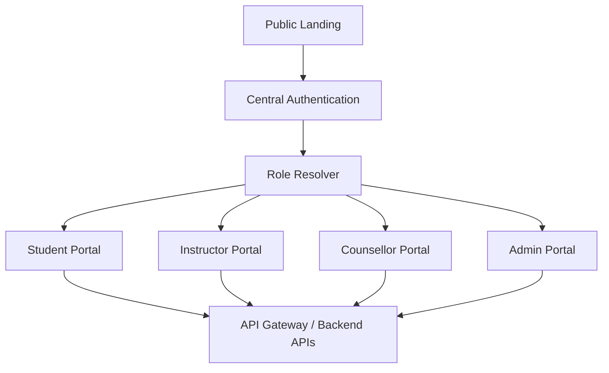

# سند مرجع پروژه گرادیان

**نام سند:** Gradian Frontend & Integration Engineering Guide  
**وضعیت:** سند مرجع اولیه برای طراحی، پیاده‌سازی و همکاری تیمی  
**نسخه:** 0.1.0  
**آخرین به‌روزرسانی:** 2026-10-06  
**زبان سند:** فارسی؛ نام‌گذاری‌های فنی به انگلیسی  
**دامنه:** وب‌سایت عمومی، احراز هویت، پرتال‌های نقش‌محور و اتصال آن‌ها به میکروسرویس‌های بک‌اند

---

## 1. هدف این سند

این فایل قرارداد مشترک بین تیم طراحی، تیم‌های Frontend، تیم‌های Backend و دستیار هوش مصنوعی پروژه است. هر تغییر مهم در معماری، قرارداد API، نقش‌ها، مسیرها، روش احراز هویت یا ساختار پوشه‌ها باید در همین سند ثبت شود.

این سند باید برای کارهای زیر استفاده شود:

- تصمیم‌گیری درباره ساختار React و مرز مسئولیت فایل‌ها؛
- تبدیل فریم‌های طراحی به کامپوننت‌های قابل استفاده مجدد؛
- اتصال داشبوردها به APIهای Django؛
- جلوگیری از ایجاد منطق تکراری در پرتال‌های مختلف؛
- مشخص‌کردن قرارداد بین Frontend و میکروسرویس‌ها؛
- تعریف قواعد چندزبانه‌سازی فارسی/انگلیسی و RTL/LTR؛
- تعریف رفتار تم روشن/تیره؛
- اجرای یکسان پروژه با Docker؛
- تحویل کد قابل توسعه، قابل بررسی و قابل استفاده توسط دانشجوهای دیگر؛
- فراهم‌کردن context دقیق برای تولید یا اصلاح کد توسط AI.

این سند جایگزین مستندات تخصصی هر میکروسرویس، قرارداد OpenAPI، مستندات امنیتی و تصمیم‌های رسمی تیم Backend نیست؛ بلکه آن‌ها را به Frontend متصل می‌کند.

---

## 2. خلاصه محصول

گرادیان یک پلتفرم آموزشی آنلاین برای داوطلبان کنکور کامپیوتر، به‌خصوص کنکور کارشناسی ارشد و دکتری کامپیوتر، است. محصول قرار است محتوای آموزشی، آزمون، تحلیل عملکرد، مشاوره، ارتباط با استاد و رتبه‌های برتر، منابع و امکانات اجتماعی یادگیری را در یک اکوسیستم ارائه کند.

کاربران اصلی سیستم:

| نقش | هدف اصلی |
|---|---|
| Visitor | مشاهده Landing Page، معرفی خدمات و ورود به سامانه |
| Student | استفاده از آزمون، محتوای آموزشی، تحلیل، برنامه‌ریزی و کامیونیتی |
| Instructor | ساخت سؤال و دوره، ارائه خدمات آموزشی و مدیریت محتوای آموزشی |
| Counsellor | پیگیری دانشجو، مشاوره و مدیریت برنامه و گزارش‌ها |
| Top Ranker | ارائه تجربه، رفع اشکال و خدمات منتورینگ |
| Admin | مدیریت کاربران، محصولات، آزمون‌ها، احراز هویت و داده‌های مدیریتی |

احراز هویت متمرکز است. پس از ورود، بر اساس نقش کاربر، او به پرتال مناسب هدایت می‌شود.

---

## 3. منابع دریافت‌شده و میزان اتکا به آن‌ها

### 3.1 خروجی‌های طراحی

فایل‌های زیر از فریم‌های طراحی دریافت شده‌اند:

- `main-page(1).zip`: Landing Page و معرفی سازمان؛
- `auth-service.zip`: صفحه ورود به سامانه؛
- `student-portal.zip`: پرتال دانش‌آموز؛
- `instructor-portal.zip`: پرتال استاد؛
- `counsellor-portal.zip`: پرتال مشاور/رتبه برتر؛
- `admin-portal.zip`: پرتال ادمین.

این zipها شامل `index.html`، `styles.css` و assetهای SVG/JPG هستند. در آن‌ها JavaScript، React source، route definition یا API integration وجود ندارد. بنابراین این فایل‌ها مرجع بصری هستند و نباید مستقیماً به‌عنوان معماری نهایی Frontend استفاده شوند.

مشاهدات مهم درباره خروجی طراحی:

- بخش زیادی از CSS ثابت و مبتنی بر اندازه‌های پیکسلی است؛
- در چند صفحه، نام کلاس‌ها عمومی و تولیدشده مانند `container-5` و `heading-2` هستند؛
- برخی چیدمان‌ها absolute-positioned هستند؛
- متن فارسی داخل HTML وجود دارد، اما بعضی فایل‌ها `lang="en"` دارند؛
- در متن‌ها از `<br>` ثابت استفاده شده است؛
- این خروجی‌ها برای بازسازی ظاهر مفیدند، ولی برای Responsive behavior و component hierarchy باید تصمیم مهندسی جداگانه گرفته شود.

### 3.2 PDF شرح جریان‌ها

`core.pdf` جریان‌های سطح بالای صفحات را ثبت می‌کند:

- Landing Page: دکمه‌های «شروع به یادگیری» و «ورود به پورتال» فعال هستند؛
- Authentication: ورود با شماره موبایل و رمز عبور؛
- Student Portal: ده سرویس عملیاتی دارد و فقط سرویس‌های مشخص‌شده فعلاً به گروه‌های دیگر متصل می‌شوند؛
- Admin Portal: سه سرویس مدیریتی اصلی دارد و محتوای سرویس داخل ناحیه اصلی صفحه به‌صورت پویا نمایش داده می‌شود؛
- Counsellor Portal: شش سرویس اصلی دارد و محتوای سرویس به‌صورت پویا در ناحیه اصلی نمایش داده می‌شود؛
- Instructor Portal: شش سرویس اصلی دارد و محتوای سرویس به‌صورت پویا در ناحیه اصلی نمایش داده می‌شود؛
- برای استفاده آزمایشی، کاربران نقش‌های مختلف باید در دیتابیس وجود داشته باشند.

### 3.3 Excel فهرست میکروسرویس‌ها

`Book1 (2).xlsx` فهرست میکروسرویس‌ها را در دو Sheet ارائه می‌کند:

- Sheet1: فهرست شماره‌گذاری‌شده سرویس‌ها و توضیح هرکدام؛
- Sheet2: گروه‌بندی سرویس‌ها در منابع، آموزش، مشاوره، میز من، کامیونیتی، ارزیابی و زیرساخت.

این فهرست مبنای نام‌گذاری مفهومی است. تا زمانی که قرارداد واقعی endpointها، payloadها و owner هر سرویس مشخص نشده، Frontend نباید آن‌ها را قطعی و hard-code فرض کند.

---

## 4. تصمیم معماری کلان

### 4.1 مدل پیشنهادی Frontend

در فاز فعلی، یک React application مشترک برای Landing، Authentication و تمام Portalها توصیه می‌شود. جداسازی میکروسرویس‌های Backend نباید باعث تکثیر کدهای مشترک Frontend شود.



### 4.2 چرا یک Frontend مشترک؟

این انتخاب برای پروژه فعلی باعث می‌شود:

- Header، Sidebar، Button، Card، فرم، خطا و Layout تکرار نشوند؛
- زبان، تم، احراز هویت و permissionها یک‌بار پیاده‌سازی شوند؛
- دانشجوها بر اساس یک قرارداد واحد Feature اضافه کنند؛
- build و Docker ساده‌تر شود؛
- تغییرات طراحی در کل محصول هماهنگ بماند.

Micro-frontend فقط در صورتی بررسی شود که تیم‌ها نیاز واقعی به انتشار مستقل، repository مستقل و چرخه release مستقل داشته باشند. صرفاً زیادبودن تعداد Backend serviceها چنین نیازی ایجاد نمی‌کند.

### 4.3 مرز مهم بین Backend و Frontend

هر میکروسرویس مالک داده و business rule خودش است. Frontend نباید business rule اصلی را بازسازی کند یا به دیتابیس سرویس‌ها دسترسی داشته باشد.

Frontend مسئول این موارد است:

- نمایش وضعیت و داده؛
- دریافت ورودی کاربر؛
- اعتبارسنجی اولیه تجربه کاربری؛
- مدیریت loading، error و empty state؛
- ارسال درخواست از طریق API؛
- کنترل دسترسی نمایشی بر اساس نقش/permission؛
- هماهنگی مسیرها و Layoutها.

Backend مسئول این موارد است:

- احراز هویت واقعی؛
- permission و authorization واقعی؛
- اعتبارسنجی نهایی؛
- business rule؛
- consistency داده؛
- ثبت رخدادها و audit؛
- پاسخ استاندارد API.

پنهان‌کردن یک آیتم منو یا Route در React هرگز جایگزین permission سمت Backend نیست.

---

## 5. Stack پیشنهادی

| حوزه | انتخاب پیشنهادی | قاعده |
|---|---|---|
| Language | TypeScript | کد جدید بدون TypeScript نوشته نشود |
| Build | Vite | نسخه و package manager در کل تیم ثابت باشد |
| UI | React | Components function-based و Hooks |
| Routing | React Router | Layout و nested route برای پرتال‌ها |
| Server state | TanStack Query | داده API در Context عمومی ذخیره نشود |
| HTTP | یک API client مشترک | endpointها داخل feature خودشان تعریف شوند |
| Forms | React Hook Form در فرم‌های پیچیده | فرم ساده می‌تواند state محلی داشته باشد |
| Validation | Zod یا قرارداد معادل | خطای API و validation محلی جدا باشند |
| i18n | i18next + react-i18next | هیچ متن UI مستقیم داخل JSX نباشد |
| Styling | CSS Modules + CSS Variables | از یک سیستم استایل یکپارچه استفاده شود |
| Icons | یک مجموعه آیکون واحد | SVG پراکنده و نام‌گذاری‌نشده اضافه نشود |
| Tests | تست جریان‌های حساس | Login، route guard و فرم‌های مهم اولویت دارند |
| Container | Docker Compose | توسعه و production build از هم تفکیک شوند |

انتخاب کتابخانه UI باید بعد از مقایسه با Figma انجام شود. استفاده هم‌زمان از چند UI library توصیه نمی‌شود.

---

## 6. ساختار repository و پوشه‌های Frontend

ساختار پیشنهادی:

```text
frontend/
├── public/
│   ├── fonts/
│   ├── locales/
│   └── favicon.svg
├── src/
│   ├── app/
│   │   ├── App.tsx
│   │   ├── providers/
│   │   │   ├── AppProviders.tsx
│   │   │   ├── AuthProvider.tsx
│   │   │   ├── I18nProvider.tsx
│   │   │   ├── ThemeProvider.tsx
│   │   │   └── QueryProvider.tsx
│   │   ├── router/
│   │   │   ├── routes.tsx
│   │   │   ├── routeGuards.tsx
│   │   │   └── routeTypes.ts
│   │   ├── layouts/
│   │   │   ├── PublicLayout.tsx
│   │   │   ├── AuthLayout.tsx
│   │   │   ├── DashboardLayout.tsx
│   │   │   └── PortalLayout.tsx
│   │   ├── navigation/
│   │   │   ├── navigation.config.ts
│   │   │   └── navigation.types.ts
│   │   └── config/
│   │       ├── env.ts
│   │       └── appConfig.ts
│   ├── features/
│   │   ├── landing/
│   │   ├── auth/
│   │   ├── student-portal/
│   │   ├── instructor-portal/
│   │   ├── counsellor-portal/
│   │   ├── admin-portal/
│   │   ├── question-bank/
│   │   ├── mock-exam/
│   │   ├── learning-content/
│   │   ├── consultation/
│   │   └── community/
│   ├── shared/
│   │   ├── ui/
│   │   │   ├── Button/
│   │   │   ├── Card/
│   │   │   ├── Modal/
│   │   │   ├── Input/
│   │   │   ├── Select/
│   │   │   ├── Table/
│   │   │   ├── Badge/
│   │   │   ├── EmptyState/
│   │   │   ├── ErrorState/
│   │   │   └── LoadingState/
│   │   ├── api/
│   │   │   ├── httpClient.ts
│   │   │   ├── apiError.ts
│   │   │   └── queryKeys.ts
│   │   ├── hooks/
│   │   ├── lib/
│   │   │   ├── date.ts
│   │   │   ├── number.ts
│   │   │   ├── permissions.ts
│   │   │   └── storage.ts
│   │   ├── types/
│   │   └── styles/
│   │       ├── globals.css
│   │       ├── tokens.css
│   │       └── rtl.css
│   ├── locales/
│   │   ├── fa/
│   │   │   ├── common.json
│   │   │   ├── navigation.json
│   │   │   ├── auth.json
│   │   │   ├── student.json
│   │   │   ├── instructor.json
│   │   │   ├── counsellor.json
│   │   │   └── admin.json
│   │   └── en/
│   │       ├── common.json
│   │       ├── navigation.json
│   │       ├── auth.json
│   │       ├── student.json
│   │       ├── instructor.json
│   │       ├── counsellor.json
│   │       └── admin.json
│   └── assets/
│       ├── images/
│       └── icons/
├── .env.example
├── Dockerfile
├── Dockerfile.dev
├── docker-compose.yml
├── nginx.conf
├── package.json
├── tsconfig.json
├── vite.config.ts
└── README.md
```

### 6.1 قاعده Feature-based

هر قابلیت باید UI، API، Hook و Type مربوط به خودش را تا حد ممکن کنار هم نگه دارد:

```text
features/mock-exam/
├── api/
│   ├── mockExamApi.ts
│   └── mockExamQueries.ts
├── components/
│   ├── ExamCard.tsx
│   ├── ExamFilters.tsx
│   └── ExamSummary.tsx
├── hooks/
│   └── useMockExamFilters.ts
├── pages/
│   ├── MockExamListPage.tsx
│   └── MockExamDetailsPage.tsx
├── types/
│   └── mockExam.types.ts
└── index.ts
```

`shared` فقط زمانی محل انتقال یک جزء است که آن جزء واقعاً در چند Feature استفاده شود و وابستگی اختصاصی به یک ماژول نداشته باشد.

### 6.2 قانون وابستگی

- `app` می‌تواند Featureها و Shared را به هم متصل کند؛
- `features` می‌توانند از `shared` استفاده کنند؛
- `shared` نباید به Feature خاصی import داشته باشد؛
- یک Feature نباید به فایل داخلی Feature دیگر دسترسی مستقیم داشته باشد؛
- خروجی عمومی هر Feature از طریق `index.ts` کنترل شود؛
- import با alias ثابت مانند `@/features/...` ترجیح دارد؛
- importهای نسبی چندلایه مثل `../../../../` ممنوع است.

---

## 7. ساختار پرتال‌ها و Layoutها

### 7.1 Layoutهای اصلی

`PublicLayout` برای Landing و صفحات عمومی استفاده می‌شود.

`AuthLayout` برای Login، OTP، فراموشی رمز و وضعیت‌های احراز هویت استفاده می‌شود.

`PortalLayout` قالب مشترک پرتال‌های نقش‌محور است و معمولاً این بخش‌ها را دارد:

- Sidebar یا Navigation؛
- Header؛
- اطلاعات کاربر؛
- دکمه تغییر زبان؛
- دکمه تغییر تم؛
- اعلان‌ها؛
- Logout؛
- عنوان صفحه و Breadcrumb در صورت نیاز؛
- محتوای متغیر Route.

`DashboardLayout` می‌تواند نسخه عمومی‌تر `PortalLayout` باشد. اگر پرتال‌های ادمین، استاد، مشاور و دانشجو تفاوت بصری جزئی دارند، از یک Layout پایه با configuration استفاده شود، نه چهار پیاده‌سازی کاملاً جدا.

### 7.2 Nested Routes

هر Portal یک parent route دارد و صفحات سرویس‌ها داخل آن render می‌شوند. محتوای فعال در محل `Outlet` نمایش داده می‌شود.

نمونه مفهومی مسیرها:

```text
/
├── /login
├── /student
│   ├── /student/overview
│   ├── /student/exams
│   ├── /student/content
│   └── /student/study-plan
├── /instructor
│   ├── /instructor/overview
│   ├── /instructor/questions
│   └── /instructor/courses
├── /counsellor
│   ├── /counsellor/overview
│   ├── /counsellor/students
│   └── /counsellor/consultations
└── /admin
    ├── /admin/overview
    ├── /admin/users
    └── /admin/products
```

مسیرهای دقیق باید بعد از نهایی‌شدن قرارداد تیم تثبیت شوند. مسیرها نباید به نام داخلی یک Backend service گره بخورند؛ URL باید بر اساس تجربه کاربر و Feature باشد.

### 7.3 منوی پویای نقش‌محور

منو باید از configuration ساخته شود، نه با چندین شرط پراکنده در JSX.

هر آیتم منو می‌تواند این اطلاعات را داشته باشد:

- `id` ثابت؛
- `labelKey` برای ترجمه؛
- `path`؛
- `icon`؛
- `requiredRoles`؛
- `requiredPermissions`؛
- `featureFlag` در صورت نیاز؛
- `children` برای منوی تو در تو؛
- `order`.

فیلتر منو فقط برای تجربه کاربری است. دسترسی API باید در Backend enforce شود.

---

## 8. اجزای reusable و روش ساخت آن‌ها

### 8.1 سطح‌بندی Componentها

| سطح | مثال | محل |
|---|---|---|
| Primitive | Button، IconButton، Text، Stack | `shared/ui` |
| Common UI | Modal، Table، Pagination، SearchBox | `shared/ui` |
| Layout | Header، Sidebar، PageContainer | `app/layouts` یا `shared/ui` |
| Feature UI | ExamCard، StudentProgressChart | Feature مربوطه |
| Page | StudentOverviewPage | `features/.../pages` |

### 8.2 قرارداد Component

هر Component reusable باید:

- یک مسئولیت مشخص داشته باشد؛
- API props محدود و قابل فهم داشته باشد؛
- متن ثابت UI داخل خودش hard-code نکند؛
- وضعیت loading/error را در صورت نیاز پشتیبانی کند؛
- با RTL/LTR کار کند؛
- رنگ را از token بگیرد؛
- وابسته به endpoint خاص نباشد، مگر اینکه Feature component باشد؛
- از `any` استفاده نکند؛
- تست یا حداقل مثال استفاده داشته باشد، اگر جزء مهم است.

### 8.3 تفاوت Component و Hook

Component منطق نمایش و تعامل UI را reusable می‌کند. Custom Hook منطق را reusable می‌کند. دو بار استفاده از یک Custom Hook state مشترک ایجاد نمی‌کند؛ هر بار state مستقل ساخته می‌شود. برای state واقعاً مشترک از parent state، Context محدود یا state manager استفاده شود.

نمونه موارد مناسب برای Hook:

- `useCurrentUser`؛
- `usePermissions`؛
- `useDebouncedValue`؛
- `usePaginationParams`؛
- `useExamResults`؛
- `useResponsiveSidebar`.

---

## 9. مدل State

### 9.1 Local UI State

برای باز و بسته‌شدن Modal، انتخاب تب، نمایش Sidebar در موبایل و ورودی کوتاه، state داخل Component بماند.

### 9.2 URL State

فیلتر، جست‌وجو، صفحه جدول و sort که قابلیت share یا refresh دارند باید در URL قرار بگیرند.

مثال:

```text
/admin/users?page=2&status=active&search=ali&sort=createdAt.desc
```

### 9.3 Server State

داده‌ای که از Django API می‌آید، cache، refetch، stale state و mutation دارد. این داده‌ها با TanStack Query مدیریت شوند.

Query key باید پایدار و معنادار باشد:

```text
['student', 'exams', { page, filters }]
```

### 9.4 Global Client State

زبان، تم، وضعیت Session و اطلاعات محدود کاربر می‌توانند در Providerهای مشخص قرار بگیرند. از تبدیل همه داده‌ها به global state خودداری شود.

### 9.5 Async State استاندارد

هر صفحه داده‌محور باید این وضعیت‌ها را داشته باشد:

- initial loading؛
- refetching؛
- success با داده؛
- success بدون داده؛
- API error؛
- permission denied؛
- offline یا network error؛
- mutation pending؛
- mutation success/error.

---

## 10. احراز هویت و نقش‌ها

### 10.1 جریان ورود

طبق PDF فعلی، Login با شماره موبایل و رمز عبور انجام می‌شود و بعد بر اساس نقش به پرتال مربوط هدایت می‌شود:

```text
Login form
   ↓
Auth API
   ↓
Access/Refresh session
   ↓
Current user + roles + permissions
   ↓
Role resolver
   ↓
Role portal
```

در صورت فعال‌شدن OTP، OTP باید یک flow جدا و قابل بازیابی داشته باشد؛ Login و OTP نباید در یک Component بزرگ و غیرقابل نگهداری ادغام شوند.

### 10.2 مواردی که Backend باید مشخص کند

- JWT یا Session/Cookie؛
- محل و روش نگهداری access token؛
- refresh token rotation؛
- endpoint فعلی user profile؛
- shape پاسخ login؛
- shape پاسخ logout؛
- انقضای token؛
- رفتار 401 و 403؛
- روش CSRF در صورت SessionAuthentication؛
- نقش‌ها و permissionها؛
- امکان داشتن چند نقش هم‌زمان؛
- مسیر redirect پس از login؛
- رفتار کاربر فاقد profile کامل.

### 10.3 Route Guard

Route guard باید با وضعیت loading احراز هویت کار کند. نباید قبل از مشخص‌شدن Session، کاربر را اشتباهاً به login بفرستد.

حالت‌های اصلی:

- Public؛
- Authenticated؛
- Unauthenticated؛
- Authenticated but unauthorized؛
- Loading session.

403 باید صفحه یا state مجزای «دسترسی ندارید» داشته باشد؛ redirect بی‌دلیل به Login خطای تشخیصی ایجاد می‌کند.

---

## 11. قرارداد API و لایه ارتباط با Django

### 11.1 اصل مهم

کامپوننت نباید مستقیماً `fetch` یا `axios` صدا بزند. مسیر پیشنهادی:

```text
Page → Feature Hook → Feature API function → Shared HTTP client → Backend
```

### 11.2 لایه‌ها

`shared/api/httpClient.ts`:

- base URL؛
- default headers؛
- timeout؛
- serialization؛
- parse پاسخ؛
- تبدیل خطا به `ApiError`؛
- مدیریت 401/403؛
- correlation/request id در صورت نیاز.

`features/.../api`:

- endpointهای همان Feature؛
- نوع request و response؛
- query function و mutation function؛
- بدون JSX.

`features/.../hooks`:

- اتصال API به UI؛
- query key؛
- cache invalidation؛
- آماده‌سازی داده برای نمایش.

### 11.3 قرارداد پیشنهادی پاسخ

قرارداد قطعی باید توسط Backend ارائه شود، اما شکل منسجم زیر پیشنهاد می‌شود:

```ts
type ApiSuccess<T> = {
  data: T;
  meta?: {
    requestId?: string;
    page?: number;
    pageSize?: number;
    total?: number;
  };
};

type ApiFailure = {
  error: {
    code: string;
    message: string;
    fieldErrors?: Record<string, string[]>;
    requestId?: string;
  };
};
```

اگر Backend قرارداد دیگری دارد، Frontend باید همان قرارداد را با یک adapter مرکزی مصرف کند؛ نباید هر Feature روش متفاوتی داشته باشد.

### 11.4 صفحه‌بندی

برای endpointهای لیستی، از ابتدا قرارداد page، pageSize، total، filters و sort مشخص شود. page و filter قابل‌اشتراک در URL نگهداری شوند.

### 11.5 API Gateway و Proxy

در توسعه و production بهتر است Frontend یک base path پایدار مانند `/api` داشته باشد. Reverse proxy یا Gateway درخواست را به سرویس مربوط هدایت کند.

Frontend نباید آدرس داخلی Docker service مانند `http://student-service:8000` را داخل browser استفاده کند. نام داخلی Docker فقط بین کانتینرها قابل دسترسی است.

---

## 12. چندزبانه‌سازی فارسی و انگلیسی

### 12.1 اصول

- زبان پیش‌فرض محصول فعلاً فارسی است؛
- زبان جایگزین انگلیسی است؛
- تمام متن‌های UI کلید ترجمه دارند؛
- کلید ترجمه به متن فارسی تبدیل نمی‌شود؛
- تغییر زبان باید `document.documentElement.lang` را به‌روزرسانی کند؛
- تغییر زبان باید `dir="rtl"` یا `dir="ltr"` را تنظیم کند؛
- ترجمه‌ها در namespaceهای feature نگهداری شوند؛
- متن API در صورت user-facing بودن از Backend code و mapping کنترل‌شده استفاده کند.

### 12.2 CSS جهت‌پذیر

برای RTL/LTR از ویژگی‌های logical CSS استفاده شود:

- `margin-inline-start` به‌جای `margin-left`؛
- `padding-inline-end` به‌جای `padding-right`؛
- `inset-inline-start` به‌جای `left`؛
- `text-align: start` به‌جای `right`؛
- `border-start-start-radius` در صورت نیاز.

استفاده از `left` و `right` فقط برای مواردی که واقعاً به مختصات فیزیکی نیاز دارند مجاز است.

### 12.3 اعداد و تاریخ

این تصمیم‌ها باید با Product/Backend نهایی شوند:

- اعداد فارسی یا لاتین؛
- تقویم میلادی یا شمسی؛
- timezone؛
- قالب تاریخ در API؛
- قالب تاریخ در جدول و کارت؛
- نمایش واحد پول و جداکننده‌ها.

این تصمیم‌ها در `shared/lib/date.ts` و `shared/lib/number.ts` متمرکز شوند.

---

## 13. Theme و Design Tokens

کامپوننت‌ها نباید رنگ hex پراکنده داشته باشند. مقدارها در token تعریف شوند:

```text
--color-primary
--color-primary-hover
--color-surface
--color-background
--color-text-primary
--color-text-secondary
--color-border
--color-success
--color-warning
--color-danger
--radius-sm
--radius-md
--shadow-card
--space-1 ... --space-8
```

هر Theme مقدار این tokenها را تعیین می‌کند. Component فقط از token استفاده می‌کند.

Themeهای پیشنهادی:

- `light`؛
- `dark`؛
- `system` در صورت نیاز.

زبان و تم باید بعد از refresh حفظ شوند، مگر Product تصمیم دیگری بگیرد. تغییر تم نباید باعث دو نسخه جداگانه از Componentها شود.

---

## 14. تبدیل طراحی فعلی به React

### 14.1 Landing Page

از `main-page(1).zip` این Componentهای احتمالی استخراج می‌شوند:

- `PublicHeader`؛
- `HeroSection`؛
- `OrganizationMissionSection`؛
- `MissionPrincipleCard`؛
- `StatisticsGrid`؛
- `FacultySpotlightSection`؛
- `FacultyCard`؛
- `TestimonialsSection`؛
- `TestimonialCard`؛
- `PublicFooter`؛
- `PrimaryCta`.

متن‌ها و آمار نمایشی فعلاً static هستند؛ اگر قرار است از CMS یا API بیایند، از همان ابتدا data model جدا داشته باشند.

### 14.2 Authentication

از `auth-service.zip`:

- `AuthPage`؛
- `LoginForm`؛
- `MobileNumberField`؛
- `PasswordField`؛
- `RememberMeField`؛
- `AuthSubmitButton`؛
- `AuthErrorMessage`؛
- در آینده `OtpForm` و `ForgotPasswordFlow`.

### 14.3 Student Portal

از `student-portal.zip`، سرویس‌های نمایشی فعلی شامل این مفاهیم هستند:

- overview و welcome؛
- countdown؛
- study streak؛
- mock exam؛
- topic/question bank؛
- final exam resources؛
- top instructors/private class؛
- book marketplace؛
- daily study plan؛
- consultation؛
- intelligent major selection؛
- top-ranker experiences؛
- video courses؛
- social learning feed.

در فاز اول همه این‌ها نباید به‌صورت Featureهای سنگین پیاده‌سازی شوند. ابتدا shell و cardهای dashboard ساخته شوند و هر سرویس عملیاتی به تیم owner خودش تحویل شود.

### 14.4 Admin Portal

از `admin-portal.zip`:

- `AdminPortalLayout`؛
- profile completion/user summary؛
- dashboard overview؛
- آزمون و شبیه‌ساز؛
- خدمات هدایت و مشاوره؛
- جلسات مشاوره؛
- مدیریت محصولات فروشگاه؛
- countdown widget.

PDF سه سرویس مدیریتی اصلی را به‌عنوان سرویس‌های متصل‌شونده مشخص کرده است. ناحیه محتوای اصلی باید با nested route یا route outlet پیاده‌سازی شود.

### 14.5 Instructor Portal

از `instructor-portal.zip`:

- profile completion؛
- overview؛
- educational progress؛
- question/exam management؛
- course creation؛
- private class؛
- resource hub؛
- countdown.

### 14.6 Counsellor Portal

از `counsellor-portal.zip`:

- profile completion؛
- overview؛
- student reports؛
- add experiences؛
- subject troubleshooting؛
- consultation sessions؛
- resource hub؛
- countdown.

---

## 15. فهرست مفهومی میکروسرویس‌ها

### 15.1 Identity و پروفایل

1. **Identity & Access Service:** ثبت‌نام، ورود، OTP، JWT، نقش‌ها و مجوزها.
2. **Admin & Analytics Service:** پنل ادمین، محصولات، آزمون‌ها، احراز هویت استاد و رتبه برتر.
3. **User Profile Service:** پروفایل دانش‌آموز، پایه، رشته، شهر، هدف و اطلاعات تحصیلی.
4. **Teacher Profile Service:** تخصص، رزومه، نرخ کلاس و تأیید هویت.
5. **Top Ranker Profile Service:** سوابق، منابع پیشنهادی و امکان چت/رزرو.

### 15.2 منابع و سؤال

6. **Question Bank Service:** نگهداری، دسته‌بندی، برچسب‌گذاری و نسخه‌بندی سؤال‌ها.
7. **Question Authoring Service:** ساخت سؤال، پاسخ تشریحی، تصویر و فرمول.
19. **Content Recommendation Service:** پیشنهاد ویدیو، سؤال، جزوه، آزمون و کلاس.
27. **Document & Book Service:** جزوه، کتاب، PDF، خلاصه و فلش‌کارت.
39. **Marketplace Service:** فروش دوره، جزوه، کتاب و خدمات آموزشی.
40. **Lending & Used Book Service:** امانت، فروش کتاب دست‌دوم، ودیعه و تحویل.

### 15.3 آزمون و ارزیابی

8. **Personal Exam Generator Service**؛
7. **Mock Exam Service**؛
9. **Exam Scoring Service**؛
10. **Result Analysis Service**؛
12. **Proctoring Service**.

این سرویس‌ها باید از نظر session آزمون، timer، autosave، submit و نتیجه، قرارداد مشخص و versioned داشته باشند.

### 15.4 آموزش و محتوای ویدیویی

20. **AI Tutor Service**؛
24. **Video Content Service**؛
25. **Live Class Service**؛
28. **Transcript Service**.

### 15.5 مشاوره و ارتباط

11. **Rank Prediction Service**؛
18. **Strategy Coach Service**؛
21. **Ranker Roadmap Service**؛
22. **Major Selection Service**؛
23. **Mentor Matching Service**؛
30. **Messaging & Chat Service**؛
34. **Private Tutoring Booking Service**؛
35. **Consultation Service**؛
36. **Top Ranker Support Service**.

### 15.6 میز شخصی و عادت

13. **Error Notebook Service**؛
14. **Spaced Repetition Service**؛
16. **Study Plan Service**؛
17. **Habit Tracker Service**؛
15. **Learning Path Service**.

### 15.7 کامیونیتی و انگیزش

31. **Q&A Community Service**؛
32. **Social Learning Service**؛
33. **Study Room Service**؛
37. **Gamification Service**.

### 15.8 مالی

38. **Payment & Wallet Service:** درگاه، کیف پول، شارژ، تسویه، فاکتور و بازگشت وجه.

---

## 16. Docker و اجرای محیط‌ها

### 16.1 توسعه

محیط توسعه باید با Compose قابل اجرا باشد و حداقل این موارد را مشخص کند:

- frontend dev server؛
- backend/gateway؛
- سرویس‌های موردنیاز برای smoke test؛
- network مشترک؛
- port mapping؛
- volumeهای توسعه؛
- healthcheck؛
- env file.

### 16.2 Production build

برای production از Multi-stage Docker build استفاده شود:

1. مرحله Node برای نصب dependency و build؛
2. مرحله Nginx برای ارائه فایل‌های static؛
3. fallback به `index.html` برای React Router؛
4. cache مناسب assetها؛
5. عدم قرارگیری secret در image.

### 16.3 Environment variables

فایل‌ها:

```text
.env.example
.env.development
.env.production
```

متغیرهای Frontend مانند `VITE_API_BASE_URL` secret نیستند و در bundle قابل مشاهده‌اند. secret واقعی فقط باید در Backend یا زیرساخت نگهداری شود.

تنظیمات environment باید از یک wrapper خوانده شوند؛ استفاده مستقیم و پراکنده از `import.meta.env` در Featureها ممنوع است.

---

## 17. قواعد کدنویسی مشترک

### 17.1 TypeScript

- `strict` فعال باشد؛
- `any` فقط با توضیح موقت و issue مشخص؛
- typeهای API از typeهای View Model جدا باشند؛
- nullability صریح باشد؛
- enum یا union برای statusها استفاده شود؛
- نام type و interface معنادار باشد؛
- فایل‌های type پسوند و نام ثابت داشته باشند.

### 17.2 Naming

- Component: `PascalCase`؛
- Hook: `useSomething`؛
- function/variable: `camelCase`؛
- constant: `UPPER_SNAKE_CASE` فقط برای ثابت‌های واقعاً global؛
- فایل Component: `ComponentName.tsx`؛
- فایل API: `featureApi.ts`؛
- فایل query: `featureQueries.ts`؛
- فایل type: `feature.types.ts`؛
- ترجمه‌ها: `namespace.json`.

### 17.3 JSX

- JSX بدون درخواست API مستقیم؛
- شرط‌های سنگین خارج از markup؛
- Componentهای بزرگ به Componentهای کوچک‌تر تقسیم شوند؛
- متن UI با `t()`؛
- inline style فقط برای مقدار واقعاً dynamic؛
- `key` پایدار و مبتنی بر شناسه واقعی داده باشد.

### 17.4 Error handling

خطای شبکه، خطای اعتبارسنجی، 401، 403، 404 و 500 باید قابل تفکیک باشند. پیام خام Backend بدون mapping مناسب مستقیماً به کاربر نمایش داده نشود.

### 17.5 Accessibility

- دکمه واقعی برای action؛
- لینک واقعی برای navigation؛
- label برای input؛
- keyboard navigation؛
- focus state؛
- alt مناسب تصویر؛
- contrast قابل قبول؛
- فقط از رنگ برای انتقال وضعیت استفاده نشود.

---

## 18. قواعد Git و همکاری تیمی

### 18.1 Branch

نام branch باید حوزه تغییر را مشخص کند:

```text
feature/student-dashboard
feature/auth-login
fix/rtl-sidebar
refactor/shared-table
chore/docker-frontend
```

### 18.2 Commit

پیام commit کوتاه، امری و مشخص باشد:

```text
feat(auth): add role-based redirect
feat(student): add dashboard shell
fix(layout): preserve sidebar state on mobile
refactor(api): normalize error responses
```

### 18.3 مالکیت فایل

قبل از تغییر فایل‌های زیر بین TAها توافق شود:

- router؛
- AppProviders؛
- auth؛
- shared UI؛
- tokens و globals؛
- Docker و nginx؛
- navigation config.

این فایل‌ها نقاط برخورد تیمی هستند و تغییر هم‌زمان بدون هماهنگی conflict تولید می‌کند.

### 18.4 Pull Request

هر PR باید شامل این موارد باشد:

- هدف تغییر؛
- Feature یا route مربوط؛
- تغییر API در صورت وجود؛
- screenshot برای تغییر UI؛
- وضعیت RTL/LTR؛
- وضعیت mobile؛
- تست یا روش بررسی؛
- migration یا env جدید در صورت وجود.

---

## 19. قرارداد استفاده از AI در توسعه

این سند باید قبل از تولید کد به AI داده شود. برای هر درخواست کدنویسی، این اطلاعات نیز ارائه شود:

1. هدف دقیق تغییر؛
2. Feature و Route مربوط؛
3. فایل‌های مجاز برای تغییر؛
4. API contract یا mock data؛
5. نقش‌ها و permissionهای مرتبط؛
6. حالت‌های loading/error/empty؛
7. زبان و theme مورد انتظار؛
8. محدودیت‌های Responsive؛
9. اینکه تغییر باید backward-compatible باشد یا نه؛
10. فرمان build/test مورد انتظار.

AI قبل از تغییر باید:

- repository و فایل‌های مرتبط را بخواند؛
- وابستگی‌های موجود را بررسی کند؛
- از ساخت فایل تکراری خودداری کند؛
- قرارداد API موجود را حفظ کند؛
- فقط فایل‌های لازم را تغییر دهد؛
- نتیجه و فایل‌های تغییرکرده را گزارش کند؛
- build یا test مناسب را اجرا کند.

AI نباید:

- بدون دلیل Redux یا کتابخانه جدید اضافه کند؛
- business rule Backend را در UI بازنویسی کند؛
- متن فارسی را در JSX hard-code کند؛
- به جای permission واقعی، فقط منو را مخفی‌کردن را امنیت حساب کند؛
- routeها یا نام فیلدهای API را حدس بزند؛
- asset طراحی را بدون بررسی جایگزین کند؛
- فایل‌های غیرمرتبط را برای «تمیزکاری» تغییر دهد؛
- secret یا token را داخل کد commit کند.

قالب درخواست پیشنهادی به AI:

```text
Project context: طبق GRADIAN_FRONTEND_PROJECT_GUIDE.md کار کن.
Feature: <feature>
Route: <route>
Goal: <هدف دقیق>
Allowed files: <فهرست>
API contract: <endpoint و نمونه response>
Roles/permissions: <موارد>
States: loading, empty, error, success
Languages: fa, en
Direction: RTL/LTR
Theme: light/dark
Do not change: <موارد ممنوع>
Validation: <فرمان build/test>
```

---

## 20. فازهای پیشنهادی پیاده‌سازی

### فاز صفر: تثبیت قرارداد

- نهایی‌کردن package manager؛
- نهایی‌کردن React/TypeScript/Vite؛
- تصمیم JWT یا Session؛
- دریافت OpenAPI یا قرارداد مکتوب Auth؛
- تثبیت role و permission؛
- تعیین owner هر سرویس؛
- نهایی‌کردن tokenهای طراحی.

### فاز یک: Shell مشترک

- AppProviders؛
- router؛
- PublicLayout؛
- AuthLayout؛
- PortalLayout؛
- Sidebar؛
- Header؛
- language switcher؛
- theme switcher؛
- loading/error/empty state؛
- global tokens.

### فاز دو: Landing و Auth

- بازسازی Landing؛
- Login؛
- session bootstrap؛
- role resolver؛
- route guards؛
- logout؛
- نمایش خطاهای Auth.

### فاز سه: داشبوردهای نقش‌محور

- Student shell؛
- Instructor shell؛
- Counsellor shell؛
- Admin shell؛
- navigation config؛
- dashboard cards؛
- mock data با همان shape API آینده.

### فاز چهار: اتصال سرویس‌های واقعی

هر گروه یک Feature را با قرارداد API مشخص متصل کند. هر Feature باید loading/error/empty و permission را داشته باشد.

### فاز پنج: کیفیت و تحویل

- build production؛
- اجرای Docker Compose؛
- بررسی route refresh در Nginx؛
- بررسی RTL/LTR؛
- تست viewportهای اصلی؛
- بررسی 401 و 403؛
- بررسی دسترسی keyboard؛
- ثبت known limitations.

---

## 21. تصمیم‌های باز که باید با تیم نهایی شوند

این موارد هنوز از فایل‌های دریافت‌شده قطعی نیستند:

- نام نهایی محصول و استفاده از «گرادیان» یا «دانشور» در متن‌های طراحی؛
- کامپیوتر بودن مخاطب نهایی در برابر متن‌های فعلی که در چند frame کنکور سراسری/تجربی را نشان می‌دهند؛
- فهرست دقیق نقش‌ها و امکان چندنقشی‌بودن کاربر؛
- روش احراز هویت و نگهداری token؛
- API Gateway یا اتصال مستقیم به سرویس‌ها؛
- نام و نسخه endpointها؛
- صفحه‌بندی و استاندارد خطا؛
- تقویم، timezone و فرمت اعداد؛
- کتابخانه UI نهایی؛
- وجود نسخه موبایل واقعی برای هر Portal؛
- سرویس‌هایی که در فاز اول واقعاً فعال هستند؛
- داده‌های آزمایشی و کاربران seed؛
- مالک هر سرویس و تیم پاسخ‌گو؛
- نیاز یا عدم نیاز به WebSocket برای chat/live class؛
- نیاز به upload مستقیم یا presigned upload برای فایل و ویدیو؛
- policy پرداخت و دسترسی به محتوای خریداری‌شده.

تا زمان پاسخ به این موارد، تصمیم‌های این سند باید به‌عنوان پیشنهاد معماری تلقی شوند، نه قرارداد قطعی Backend.

---

## 22. Definition of Done برای هر Feature

یک Feature زمانی آماده تحویل است که:

- مسیر آن مشخص و قابل refresh باشد؛
- permission لازم مشخص شده باشد؛
- API layer و typeهای آن جدا باشد؛
- loading، success، empty و error پیاده شده باشد؛
- در فارسی و انگلیسی متن‌های اصلی ترجمه شده باشند؛
- RTL و LTR بررسی شده باشد؛
- تم روشن و تاریک در صورت پشتیبانی بررسی شده باشد؛
- در موبایل یا محدودیت responsive آن مشخص شده باشد؛
- هیچ secretی در کد نباشد؛
- lint/typecheck/build موفق باشد؛
- screenshot یا توضیح قابل بررسی در PR وجود داشته باشد؛
- known limitationها ثبت شده باشند.

---

## 23. دستور به‌روزرسانی این سند

هر تصمیم معماری جدید باید با این قالب ثبت شود:

```text
### ADR-XXX: <عنوان تصمیم>
Date: YYYY-MM-DD
Status: proposed | accepted | deprecated
Context: <مسئله>
Decision: <تصمیم>
Consequences: <پیامدها>
Owners: <افراد/تیم>
```

اگر قراردادی از سمت Backend تغییر کرد، نسخه API، تاریخ تغییر، سرویس مالک و اثر آن روی Frontend ثبت شود.

---

## 24. وضعیت فعلی بر اساس فایل‌های بررسی‌شده

- طراحی Landing موجود است؛
- طراحی Auth موجود است؛
- طراحی پایه چهار Portal موجود است؛
- شرح flowهای اصلی در PDF موجود است؛
- فهرست مفهومی میکروسرویس‌ها در Excel موجود است؛
- کد واقعی React در فایل‌های فعلی وجود ندارد؛
- کد واقعی Django یا OpenAPI در فایل‌های فعلی وجود ندارد؛
- قراردادهای endpoint، token، role و permission هنوز باید از تیم Backend دریافت شوند؛
- می‌توان بر اساس این سند، مرحله بعدی را با ساخت shell مشترک و قرارداد mock API شروع کرد.
